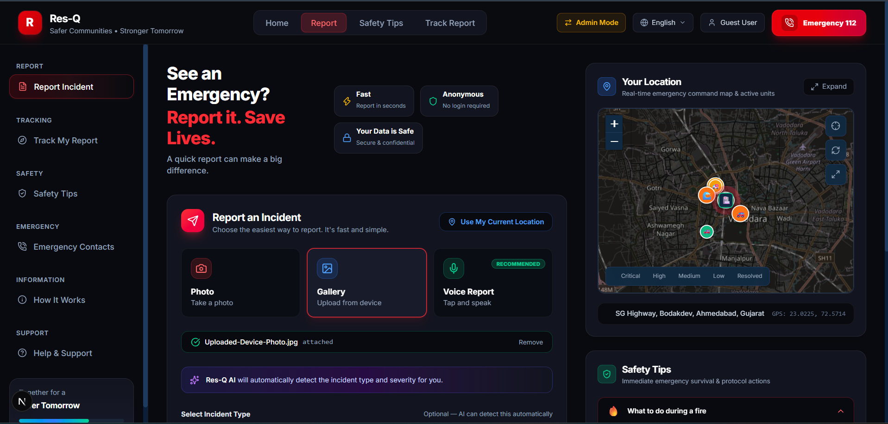
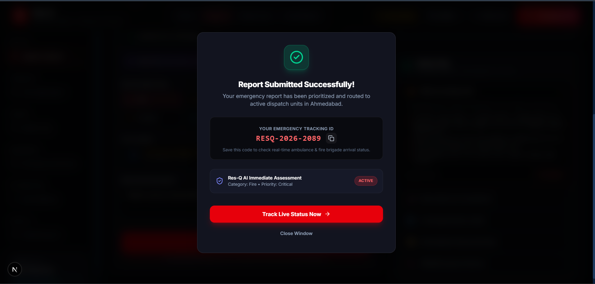
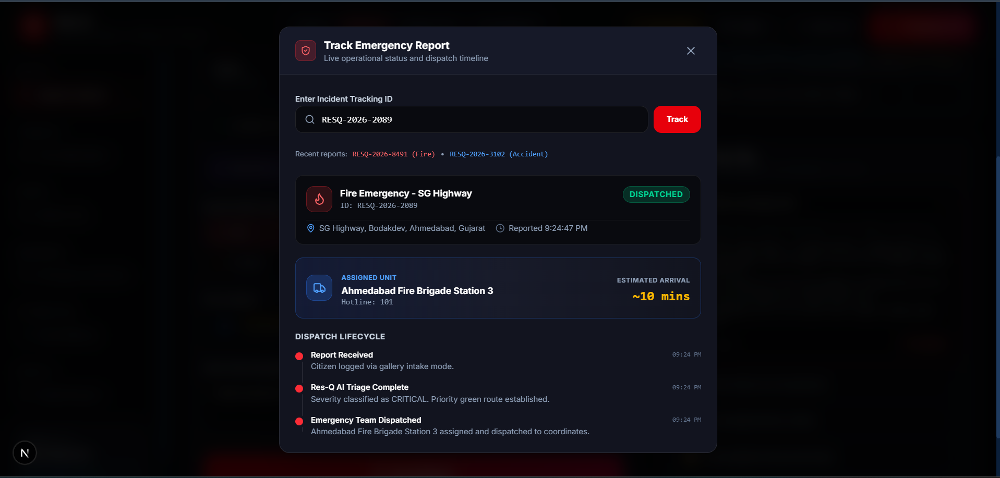
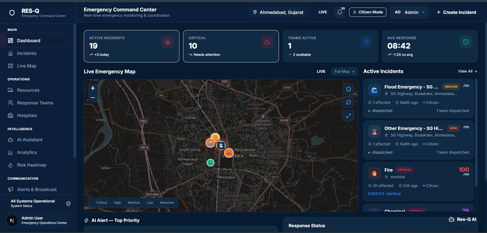
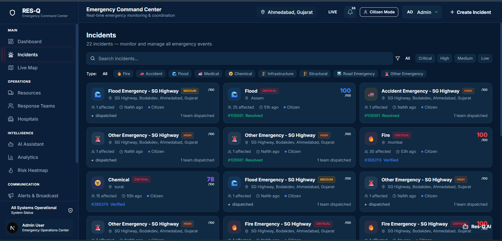
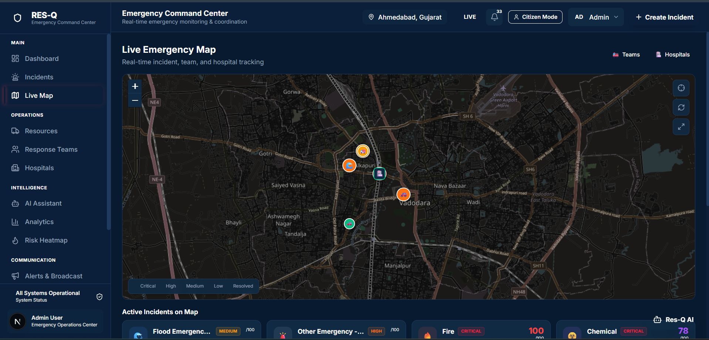
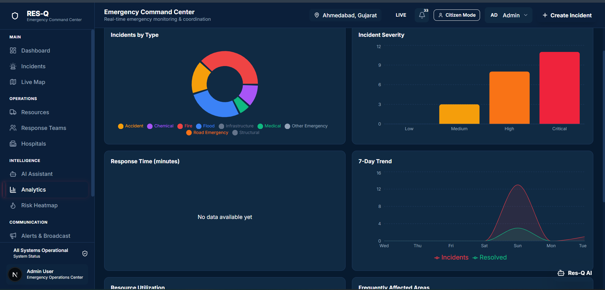

# BIT & BUILD HACKATHON 2026

## 🚨 Res-Q
### Intelligent Emergency Response & Resource Coordination Platform

**Tagline: Report Fast. Respond Faster. Save Lives.**

### Project Overview

**Res-Q** is an AI-powered emergency response and resource coordination platform designed to help citizens and emergency authorities detect, understand, and respond to emergencies faster.

During major incidents such as **fires, floods, road accidents, medical emergencies, chemical leaks, and natural disasters**, critical information can arrive from disconnected sources including citizens, emergency calls, field teams, hospitals, and government departments. This fragmented information can delay decision-making and resource deployment.

Res-Q creates a **unified intelligent emergency ecosystem** that converts these scattered reports into actionable response decisions.

### How Res-Q Works

**Report → Detect → Analyze → Prioritize → Recommend → Dispatch → Monitor → Escalate → Resolve**

Citizens can report emergencies in seconds using **photos, images, voice, or simple text**. Res-Q automatically detects the user's location and sends the information to the AI engine.

The AI system then:

- Automatically detects and classifies the incident.
- Identifies duplicate or related reports.
- Estimates incident intensity.
- Assigns a **Low, Medium, High, or Critical** severity score.
- Generates an explainable confidence score.
- Verifies information using multiple available sources.
- Generates an AI-powered emergency action plan.

Based on the incident's **severity, location, available resources, distance, capability, and estimated response time**, Res-Q recommends the most suitable emergency teams, vehicles, equipment, and nearby hospitals.

The authority dashboard provides a **real-time command center** with a live incident map, active emergencies, response teams, resource availability, alerts, AI recommendations, and incident timelines.

### 🚀 Key Innovation

Unlike a conventional emergency reporting system, Res-Q doesn't simply collect and display reports.

It answers three critical questions automatically:

> **What happened?**  
> **How serious is it?**  
> **What should we do next?**

Its AI-driven pipeline transforms fragmented information into coordinated action.

### ⭐ Key Features

- 🤖 AI automatic incident detection
- 🎯 AI intensity and severity scoring
- 🔗 Duplicate and related incident detection
- 🎙️ Voice-based emergency reporting
- 📍 Get current-location detection
- 📷 Photo/image-based reporting
- 🧠 Explainable AI confidence scoring
- ⚡ AI-generated emergency action plans
- 🚑 Smart resource recommendation
- 🔄 Dynamic resource reallocation
- 🏥 Hospital coordination
- 🗺️ Real-time emergency map
- 🚨 Automatic escalation for delayed responses
- 📡 Real-time team and incident monitoring
- 📢 Emergency notifications and communication
- 🔥 Risk heatmaps and predictive insights
- 📊 Emergency analytics and response analysis
- 📱 Citizen incident tracking
- 📴 Offline emergency-mode support

---

## 📸 Screenshots

### 👤 Citizen Dashboard

The citizen interface allows users to quickly report emergencies, access safety information, track submitted reports, and view their current emergency location.

---

### ✅ Emergency Report Submitted

After submitting an emergency report, Res-Q provides the citizen with a unique tracking ID and an AI-powered immediate assessment of the reported emergency.

---

### 📍 Track Emergency Report

Citizens can track their emergency report using the generated tracking ID and view the current dispatch status, assigned response unit, estimated arrival time, and response timeline.

---

### 🚨 Emergency Command Center

The admin dashboard provides a centralized command center for monitoring active incidents, critical emergencies, response teams, average response time, and the live emergency map.

---

### 📋 Incident Management

Authorities can view and manage emergency incidents with information such as incident type, severity, location, affected people, status, and dispatch information.

---

### 🗺️ Live Emergency Map

The live map provides geographic visualization of emergency incidents, response teams, and hospitals, helping authorities monitor emergency operations spatially.

---

### 📊 Emergency Analytics

The analytics dashboard provides insights into incident types, severity distribution, response trends, and emergency activity.

---

### 💡 Example

A citizen sees a major road accident and simply **speaks into the Res-Q app**:

> “Two cars have crashed and people are injured on the highway.”

Res-Q automatically:

**Detects:** 🚗 Road Accident  
**Location:** 📍 Current GPS location  
**Intensity:** 🔴 High — 84/100  
**Confidence:** 94%  
**Recommended Response:** 🚑 Ambulance + 👮 Traffic Control + 🚒 Rescue Team  
**Nearby Facility:** 🏥 Nearest suitable hospital  

The incident is then sent to the emergency command center, where authorities can monitor the response in real time.

### 🎯 Impact

Res-Q aims to reduce the time between **incident detection and emergency response** by minimizing manual reporting, reducing duplicate information, improving resource allocation, and giving responders a clear real-time view of evolving emergencies.

The platform brings **citizens, AI, emergency teams, hospitals, and authorities** into one coordinated ecosystem.

## Res-Q

### **Respond • Coordinate • Save Lives**

**BIT & BUILD HACKATHON 2026**
